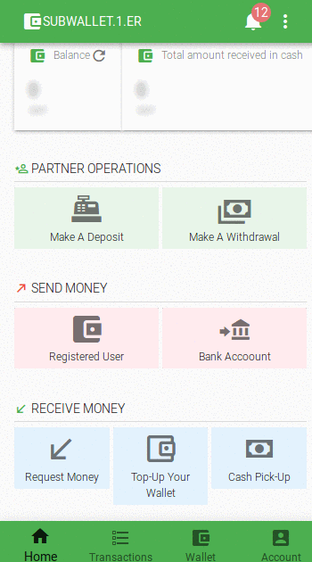

**SafiMoney API Reference Guide**

------

SafiMoney APIs 

**API Endpoint**

The URL of all our APIs are: https://api.safimoney.com/api/v2

**Authentication**

To use SafiMoney APIs, you can generate API credentials from your Wallet Dashboard.

> **Note**:
> After generating the keys from the Dashboard, you must download and save
> them securely.If you lose access to your key secret, you can generate a new key from your 
> dashboard and update all your integrations.

An API credential consists of a Key and a Secret.

> **Note**:
> The API Key is used to initiate payments, and can be exposed publicly. The API Key Secret is like your password, and should not be exposed.

   

**Errors**

SafiMoney API all responses are returned with HTTP Status code 200. 

If  Error is from SafiMoney end, you need to check the error object in the response, the code will remain 200. 