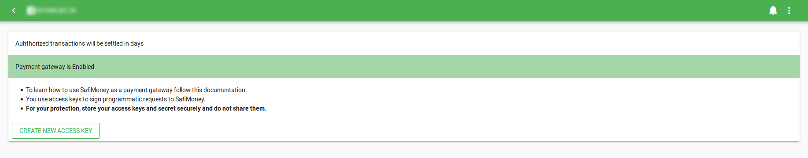
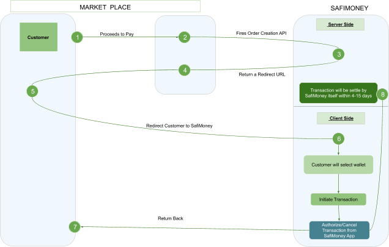
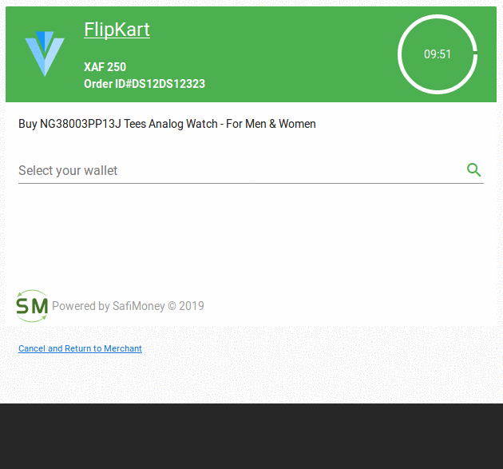
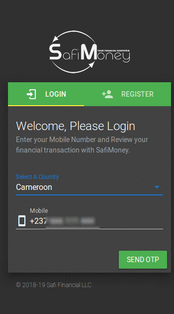

**SafiMoney Payment Gateway**

------

With the Easiest Integration, you can accept Payments from SafiMoney at your website.

> **Start and End Payment on the Same Page**. You just need to create order and leave all the complexities of payment process to us.

#### INTRODUCTION

- Visit [SafiMoney](https://app.safimoney.com) and Sign Up. 

- Create a Business Wallet to use SafiMoney as a Payment Gateway

- [Contact](https://safimoney.freshdesk.com/support/login) SafiMoney to enable Payment Gateway on your wallet.

- Once your Request will be approved you will be allowed to accept payments through SafiMoney

- Now generate the credentials of Payment Gateway from your [Wallet](https://app.safimoney.com/wallet/payment-gateway).

   

- Make sure to copy the secret as it will be displayed only once.

  

**Start Accepting Payments through SafiMoney**

------

#### PAYMENT FLOW

This is the basic representation of SafiMoney Payment Gateway Flow 



> **SDK**
For easy integration of SafiMoney Payment Gateway, checkout our [PHP Sdk](https://github.com/safimoney/safimoney-sdk-php)


#### CREATE AN ORDER

- Customer places an order on your website.

- Your server create an order creation request to SafiMoney.

  ***POST*** ***https://api.safimoney.com/api/v2***

  ------

| Bearer Header Token | Description             |
| ------------------- | ----------------------- |
| namespace           | PaymentGateway.Redirect |
| action              | createOrder             |


| Request Parameters | Description                                                  |            |
| ------------------ | ------------------------------------------------------------ | ---------- |
| order_id           | ID of the order which will be processed                      | *required* |
| amount             | Amount of the order. Transaction will be created of this amount against the order | *required* |
| language           | You can choose in which language you want your user to see the redirect page. Currently we support only two languages EN(English) and FR(french) | *optional* |
| notify_url         | Notify URL will be used as a web hook URL to give the updated status of transaction. Make sure you give a public URL | *optional* |
| success_url        | If transaction will be successfully authorised by customer then SafiMoney will redirect customer to this URL. | *required* |
| error_url          | If something goes wrong in the process then SafiMoney will redirect customer to this URL. | *required* |
| cancel_url         | On the cancellation of transaction customer will be redirected back to this URL by SafiMoney | *required* |
| store_name         | Name of your store to display in the Redirect Page           | *optional* |
| store_logo         | Logo of your store to display in the Redirect Page           | *optional* |
| store_message      | Message you want show your user while doing payment          | *optional* |

**Response**

```json
{
	"status" : 200,
    "redirect_url": "https://safimoney.test/smpg/pgredirect?token=4b8a15df-3333-4059-	  					  907e97414&lang=en",
    "order_id" : "ABCD123"
}
```


- In the Response, SafiMoney will return a URL. you need to redirect your customer to the given redirect URL.

- Now all the process will be handled by SafiMoney itself.

- SafiMoney will redirect customer to the redirect URL.

- In the Redirect Page customer needs to select his wallet from which he wants to process this order.

- Once the Transaction will be initiated by customer, he needs to login into SafiMoney and Process the Transaction

  

- The Transaction will be settled by SafiMoney itself in a certain period of time. Till the settlement you are allowed to cancel the transaction.

  

  


#### GET ORDER

- you can get the details of your order from this API endpoint

  ***POST*** ***https://api.safimoney.com/api/v2***

  ------

| Bearer Header Token | Description             |
| ------------------- | ----------------------- |
| namespace           | PaymentGateway.Redirect |
| action              | getOrder                |


| Request Parameters | Description     |          |
| ------------------ | --------------- | -------- |
| order_id           | ID of the order | required |

**Response**

```json
{
	"status" : 200,
    "order": {
        "id": "0fae24f8-d7ca-4f65-b9af-da41d1a4ee9d",
        "amount": "250", 
        "params": {
            "error_url": "https://example.com",
            "cancel_url": "https://example.com",
            "notify_url": "https://example.com",
            "success_url": "https://example.com", 
            "store_logo": "https://example.png", 					    							"store_name": "Example", 
            "store_message": "Buy NG38003PP13J Tees Analog Watch - For Men & 						      Women"
        }, 
        "language": "en", 
        "order_id": "DSDS12323", 
        "wallet_id": "*****34211212",
        "created_at": "2019-08-21 08:23:20", 
        "updated_at": "2019-08-21 08:23:20", 
        "amount_currency": "XAF"
    }, 
    "customer": {
        "name": "dummy", 
        "country": "CM",
        "wallet_id": "1000000000000000",
        "wallet_name": "dummy"
    },
    "transaction": {
        "id": "1000000000000201", 
        "fee": "5.0000", 
        "status": 100,
        "created_at": "2019-08-21 08:23:35",
        "amount_paid": "250.0000",
        "exchange_rate": "1.0000", 
        "amount_received": "245.0000",
        "paid_in_currency": "XAF", 
        "received_in_currency": "XAF"
    }
}
```


#### WEB HOOKS

Web hooks allow you to build or set up integration which subscribe to certain events on SafiMoney API. You can set up web hook by providing notify_url in order creation request.

**Available Events**

| Events                     | Description                                     |
| -------------------------- | ----------------------------------------------- |
| **transaction.authorized** | Triggered whenever a transaction is authorized. |
| **transaction.cancelled**  | Triggered whenever a transaction is cancelled.  |
| **transaction.settled**    | Triggered whenever a transaction is settled.    |

**Web hook Response**

```json
{	
    "payload": 
    {
        "event": "transaction.cancelled",
        "signature": {
            "key": "8ddf7ef0-bb5b-11e9-a894-29da1a84b5cb", 
            "hash": "142b1e21bb2cee962bc75f71f4f0736047431b2587fe83ced1434b984df50c19", 			"random": "876d965f-9d76-477d-baa3-31d46d1d0785"
        },
        "created_at": "2019-08-21 04:58:29",
        "order": {
            "id": "0fae24f8-d7ca-4f65-b9af-da41d1a4ee9d",
            "amount": "250", 
            "params": {
                        "error_url": "https://example.com",
                        "cancel_url": "https://example.com",
                        "notify_url": "https://example.com",
                        "success_url": "https://example.com", 
                        "store_logo": "https://example.png", 					    							"store_name": "Example", 
                        "store_message": "Buy NG38003PP13J Tees Analog Watch - For Men & 						      Women"
                     }, 
            "language": "en", 
            "order_id": "DSDS12323", 
            "wallet_id": "*****34211212",
            "created_at": "2019-08-21 08:23:20", 
            "updated_at": "2019-08-21 08:23:20", 
            "amount_currency": "XAF"
        }, 
        "customer": {
            "name": "dummy", 
            "country": "CM",
            "wallet_id": "1000000000000000",
            "wallet_name": "dummy"
        },
        "transaction": {
            "id": "1000000000000201", 
            "fee": "5.0000", 
            "status": 100,
            "created_at": "2019-08-21 08:23:35",
            "amount_paid": "250.0000",
            "exchange_rate": "1.0000", 
            "amount_received": "245.0000",
            "paid_in_currency": "XAF", 
            "received_in_currency": "XAF"
        }
    }
}
```

- We are sending a signature in the web hook. Using this signature, you can validate that the web hook is from SafiMoney.

  ```
  Signature hash is created as followes 
  
  hash('SHA256', your_api_key+ signature->random_number + your_api_secret);
  ```

  

- All web hook responses must return a status code in the range `200`

- If we receive response codes other than this or if the request times out, it is considered a failure. On failure, a web hook is retried once every hour for 24 hours. If we keep receiving failure responses 
  consecutively for 24 hours, we will disable the web hook for that transaction.

  
